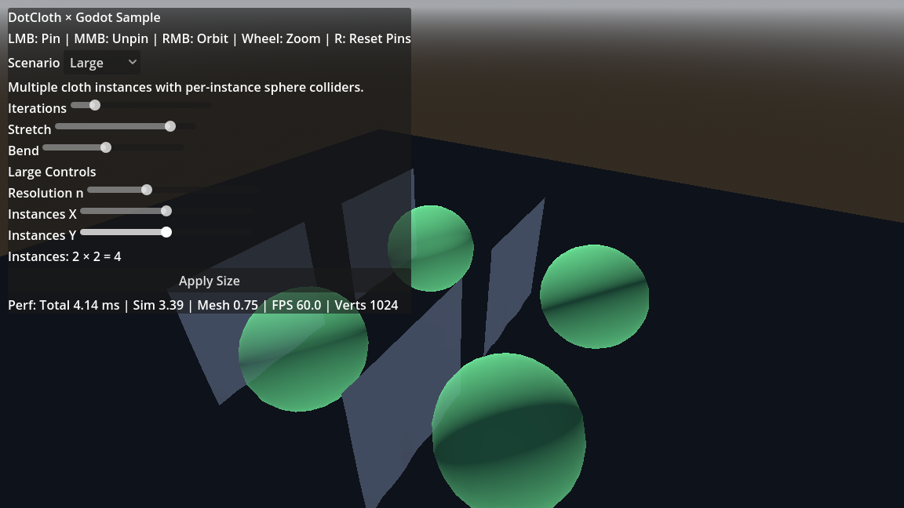

# DotCloth

## Note
- This repository’s code and documentation annotations are 100% produced with Codex (OpenAI) assistance and maintained under human review.

High‑performance, UnityCloth‑compatible cloth simulation library targeting .NET 9.0. DotCloth mirrors UnityCloth’s parameter model while using a velocity‑level sequential‑impulses solver by default. An experimental XPBD path can be built behind a compile flag for research.

⚠️ Performance is under active improvement; targeting roughly 5× higher throughput.

## Screenshot
- 
- 
- ⚠️ These captures come from an experimental build with higher throughput; the mainline solver is currently slower.

## Goals
- UnityCloth‑compatible parameter structure and behavior alignment where practical.
- Cross‑platform .NET 9.0 library with strong static safety (nullable enabled, warnings as errors).
- Thread‑safe design suitable for integration into host apps/engines.
- Robust unit tests and CI for format/lint/typecheck/test.
- Documentation‑first: design and API docs under `docs/`.

## Getting Started
- Build: `dotnet build`
- Test: `dotnet test` (xUnit)

## Quick Example
```csharp
var positions = new[] { new Vector3(0,0,0), new Vector3(1,0,0), new Vector3(0,-1,0), new Vector3(1,-1,0) };
var triangles = new[] { 0,1,2, 2,1,3 };
var velocities = new Vector3[positions.Length];
var p = new ClothParameters { UseGravity = true, StretchStiffness = 0.9f, BendStiffness = 0.5f, Iterations = 10 };
var solver = new PbdSolver();
solver.Initialize(positions, triangles, p);
solver.PinVertices(0); // anchor one corner
solver.SetColliders(new [] { new PlaneCollider(new Vector3(0,1,0), 0f) });
solver.Step(0.016f, positions, velocities);
```

## Repository Structure
- `docs/` — Design notes, algorithms, API, glossary.
- `src/` — Library code (`DotCloth`).
- `tests/` — Unit tests (`DotCloth.Tests`).
- `AGENTS.md` — Project agent rules (extends team defaults).

## Documentation
- Auto-generated docs (DocFX) + guides live under `docs/docfx`. CI builds and can publish to GitHub Pages.
- Legal notes are available under `docs/legal/LEGAL_NOTES.md`.
 - Default solver is velocity‑level (no position projection / no XPBD lambda accumulation). To experiment with XPBD, build with `DOTCLOTH_EXPERIMENTAL_XPBD` and use `XpbdSolver` directly.

## Contributing
- Follow the rules in `AGENTS.md`.
- Keep changes cohesive, documented, and covered by tests.

## Godot Sample
- Requirements: Godot 4.2+ with .NET (4.3 recommended) and .NET SDK 8.0.
- Open `examples/DotCloth.GodotSample` in the Godot editor and press Play.
- The library multi‑targets `net9.0;net8.0` so Godot can consume `net8.0`.
- The sample is included in the solution but disabled from default builds to keep CI green.

## License
- Apache License 2.0. See `LICENSE` and `NOTICE`.

## Legal
- Terminology such as “Position‑Based Dynamics (PBD)” and “Extended Position‑Based Dynamics (XPBD)” is used descriptively with references to public literature only; no third‑party code is included.
- “Unity” and “UnityCloth” are associated with products of Unity Technologies. Any mention herein is purely descriptive (e.g., conceptual alignment) and does not imply affiliation, sponsorship, or endorsement.
- See `docs/legal/LEGAL_NOTES.md` for details and risk considerations.
- Default algorithm performance (patent‑risk‑avoidance path): see `docs/legal/LEGAL_NOTES.md#default-algorithm-performance-measured`.
