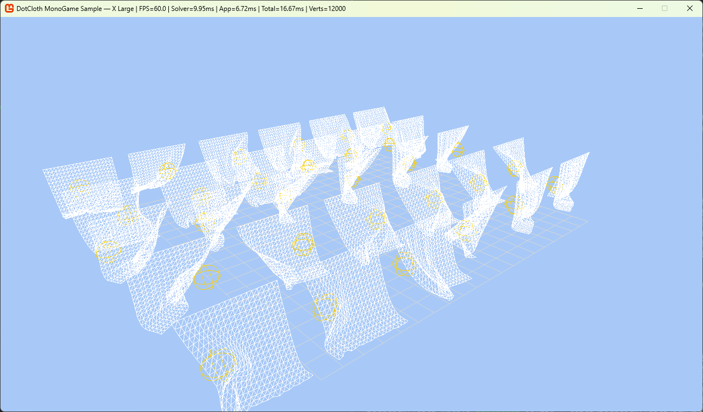
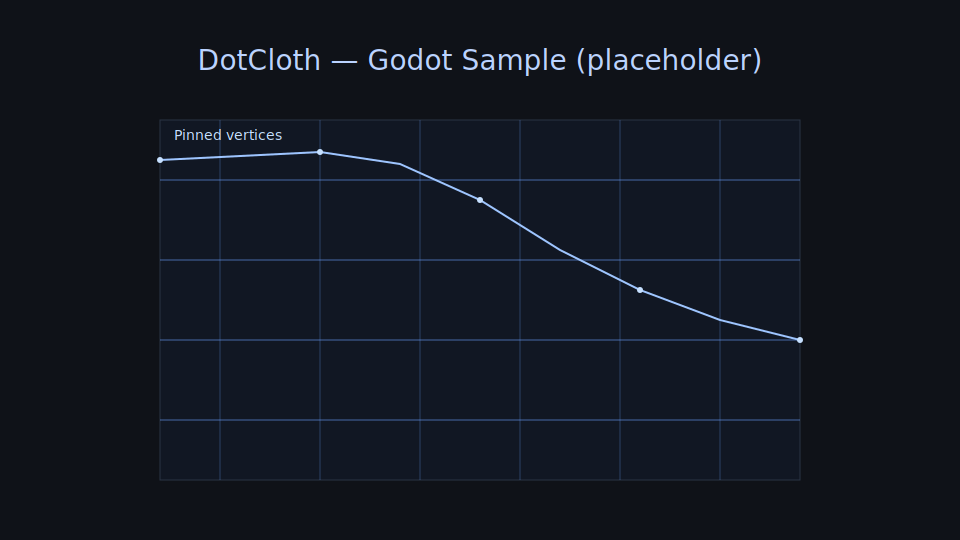

Note
- This repository’s code and documentation annotations are 100% produced with Codex (OpenAI) assistance and maintained under human review.

DotCloth
========

High‑performance, UnityCloth‑compatible eXtended PBD (XPBD) cloth simulation library targeting .NET 9.0. DotCloth aims to mirror UnityCloth’s parameter model while adopting recent PBD/XPBD research for performance, robustness, and ease of integration.

Screenshot
- 

Goals
- UnityCloth‑compatible parameter structure and behavior alignment where practical.
- Cross‑platform .NET 9.0 library with strong static safety (nullable enabled, warnings as errors).
- Thread‑safe design suitable for integration into host apps/engines.
- Robust unit tests and CI for format/lint/typecheck/test.
- Documentation‑first: design and API docs under `docs/`.

Getting Started
- Build: `dotnet build`
- Test: `dotnet test` (xUnit)

Quick Example
```
var positions = new[] { new Vector3(0,0,0), new Vector3(1,0,0), new Vector3(0,-1,0), new Vector3(1,-1,0) };
var triangles = new[] { 0,1,2, 2,1,3 };
var velocities = new Vector3[positions.Length];
var p = new ClothParameters { UseGravity = true, StretchStiffness = 0.9f, BendStiffness = 0.5f, Iterations = 10 };
var solver = new PbdSolver();
solver.Initialize(positions, triangles, p);
solver.PinVertices(0); // anchor one corner
solver.SetColliders(new [] { new PlaneCollider(new Vector3(0,1,0), 0f) });
solver.Step(0.016f, positions, velocities);
```

Repository Structure
- `docs/` — Design notes, algorithms, API, glossary.
- `src/` — Library code (`DotCloth`).
- `tests/` — Unit tests (`DotCloth.Tests`).
- `AGENTS.md` — Project agent rules (extends team defaults).

Documentation
- Auto-generated docs (DocFX) + guides live under `docs/docfx`. CI builds and can publish to GitHub Pages.
- Legal notes are available under `docs/legal/LEGAL_NOTES.md`.

Contributing
- Follow the rules in `AGENTS.md`.
- Keep changes cohesive, documented, and covered by tests.

Godot Sample
- Requirements: Godot 4.2+ with .NET (4.3 recommended) and .NET SDK 8.0.
- Open `examples/DotCloth.GodotSample` in the Godot editor and press Play.
- The library multi‑targets `net9.0;net8.0` so Godot can consume `net8.0`.
- The sample is included in the solution but disabled from default builds to keep CI green.



License
- Apache License 2.0. See `LICENSE` and `NOTICE`.

Legal
- Terminology such as “Position‑Based Dynamics (PBD)” and “Extended Position‑Based Dynamics (XPBD)” is used descriptively with references to public literature only; no third‑party code is included.
- “Unity” and “UnityCloth” are associated with products of Unity Technologies. Any mention herein is purely descriptive (e.g., conceptual alignment) and does not imply affiliation, sponsorship, or endorsement.
- See `docs/legal/LEGAL_NOTES.md` for details and risk considerations.

Performance
- The `perf/DotCloth.Perf` project provides a lightweight CPU benchmark (single‑threaded) that steps representative cloth grids and multi‑instance sets.
- Run on .NET 8 and 9 to compare:
  - `.NET 9`: `dotnet run --project perf/DotCloth.Perf -c Release --framework net9.0`
  - `.NET 8`: `dotnet run --project perf/DotCloth.Perf -c Release --framework net8.0`
- Capture environment for context (example template):
  - OS: Windows 11 23H2 / Ubuntu 24.04 / macOS 14.x
  - CPU: 12C/20T, Turbo 4.8 GHz (e.g., Intel i7‑12700H)
  - RAM: 32 GB
  - .NET SDK: output of `dotnet --info` (include RID)
  - Power plan: Balanced / High Performance (laptops may throttle)
- Sample output lines (interpreting results):
  - `Grid 64x64 ... 12 iters, 2 substeps: 16.5 ms/frame (~60.6 FPS)` → larger grids/iters increase cost roughly linearly.
  - `Instances=40 Grid 20x20 ... 8 iters: 4.2 ms/frame` → use this to size per‑frame budgets for many avatars.
- Guidance for sizing
  - Budget per frame (CPU): 1–4 ms typical for gameplay on desktop; target fewer iters/substeps and smaller grids for mobile.
  - Increase stability with substeps only when necessary; prefer tuning iterations and stiffness first.
  - Multi‑instance runs scale with vertex count; pin counts and colliders also affect cost.

Measured Results (this environment)
- Host: Linux (WSL2 kernel) ubuntu 24.04 (RID: ubuntu.24.04‑x64)
- CPU: AMD Ryzen 9 9950X3D 16‑Core Processor
- RAM: DDR5‑6800 32 GB ×2 (visible to WSL2 ~31.6 GB)
- .NET SDK: 9.0.109; Host runtime: 9.0.8
- Commands:
  - `.NET 9`: `dotnet run --project perf/DotCloth.Perf -c Release --framework net9.0`
  - `.NET 8`: `dotnet run --project perf/DotCloth.Perf -c Release --framework net8.0`
- Note: Perf excludes rendering — it measures solver/CPU only.

Tables

Single instance (frames=300, dt=1/60)

| Grid | Vertices | Iterations | Substeps | ms/frame (net9/net8) | FPS (net9/net8) |
|---:|---:|---:|---:|---:|---:|
| 32x32 | 1024 | 8  | 1 | 0.199 / 0.191 | 5021.2 / 5245.7 |
| 48x48 | 2304 | 10 | 1 | 0.533 / 0.525 | 1877.0 / 1904.6 |
| 64x64 | 4096 | 10 | 1 | 0.953 / 0.931 | 1049.6 / 1074.0 |
| 64x64 | 4096 | 12 | 2 | 2.264 / 2.208 | 441.7  / 452.8 |

Multi‑instance (40 instances, frames=300, dt=1/60)

| Grid | Vertices/inst | Iterations | Substeps | ms/frame (net9/net8) | FPS (net9/net8) |
|---:|---:|---:|---:|---:|---:|
| 20x20 | 400  | 8  | 1 | 2.762 / 2.642 | 362.0 / 378.4 |
| 24x24 | 576  | 8  | 1 | 4.104 / 3.991 | 243.7 / 250.6 |
| 28x28 | 784  | 10 | 1 | 7.071 / 6.892 | 141.4 / 145.1 |
| 32x32 | 1024 | 10 | 1 | 9.314 / 9.183 | 107.4 / 108.9 |

Notes:
- .NET 8 results: run the same perf commands with `--framework net8.0` and replace the placeholders (`—`) with measured values.
